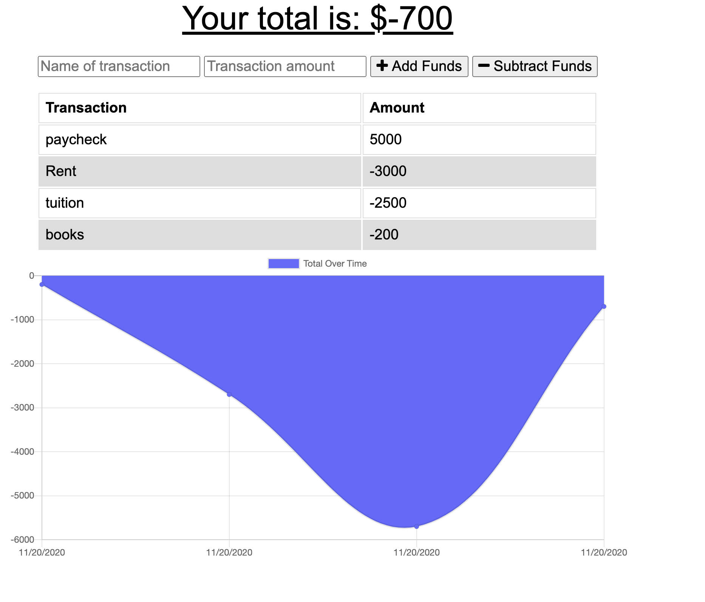

# Budget Tracker
# **Description**
This is an application designed to allow the user to create transactions and keep track of their ongoing financial status. 

## 

# **Installation**
N/A

# **Usage**
This application allows the user to keep track of their expenditures and income by creating new transactions. The user can then view a detailed graph of all previous transactions.

# **Technologies Used**
This project uses Javascript, HTML, CSS,  mongoDB and Mongoose, 

# **Credits**
Credit for this project goes to Gary Almes, he provided much of the code necessary to make this application functional.

# **License**
N/A